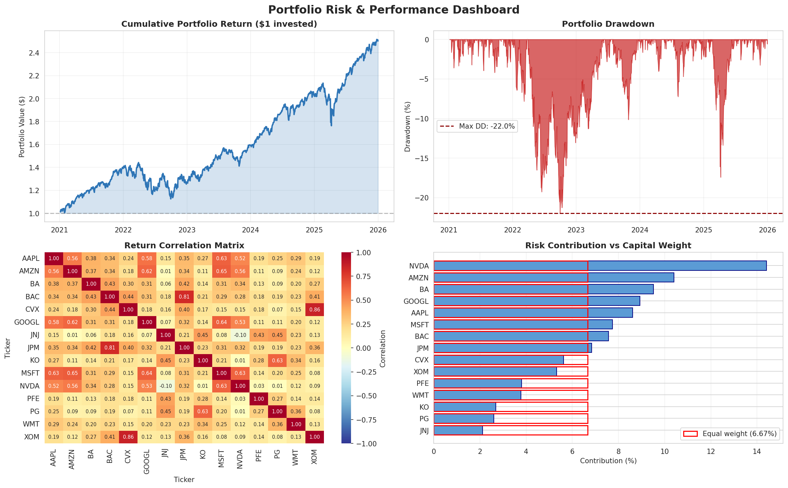

# Portfolio Risk & Performance Analytics

End-to-end Python pipeline for analysing a 15-stock equity portfolio across 
five sectors. Computes return, volatility, Sharpe ratio, maximum drawdown, 
correlation structure, and a covariance-based risk decomposition.

## Methods
- 5-year daily returns from Yahoo Finance via yfinance
- Equal-weighted construction across Tech, Financials, Energy, Healthcare, 
  Consumer Staples and Industrials
- Annualisation: 252 trading days; volatility scaled by √252
- Risk decomposition: component contribution = w · (Σw) / σ²ₚ

## Key Outputs
- Cumulative return path
- Drawdown timeline  
- Return correlation matrix
- Risk-contribution vs capital-weight comparison

## Tools
Python · pandas · numpy · matplotlib · seaborn · yfinance

## Key Findings
- Annualised return: 19.67%
- Annualised volatility: 15.79%
- Sharpe ratio: 0.973
- Maximum drawdown: -21.97%
- Top risk contributor: [NVDA] (14% of portfolio risk vs 6.67% capital weight)

## How to Run
1. Open `portfolio_analytics.ipynb` in Jupyter or Google Colab
2. Run cells sequentially from top to bottom
3. Required: `pip install yfinance pandas numpy matplotlib seaborn`
